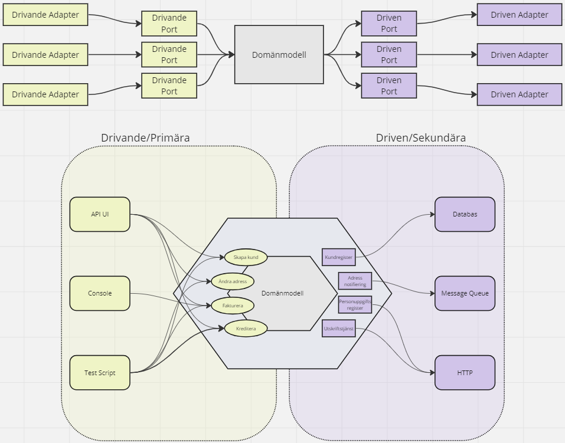

# Ports & Adapters

> _”Allow an application to equally be driven by users, programs, automated test or batch scripts, and to be developed and tested in isolation from its eventual run-time devices and databases.”_
>
> * Alistair Cockburn

<figure><figcaption></figcaption></figure>

